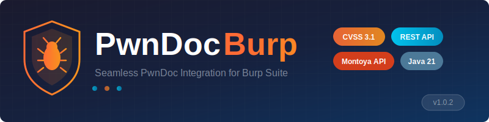
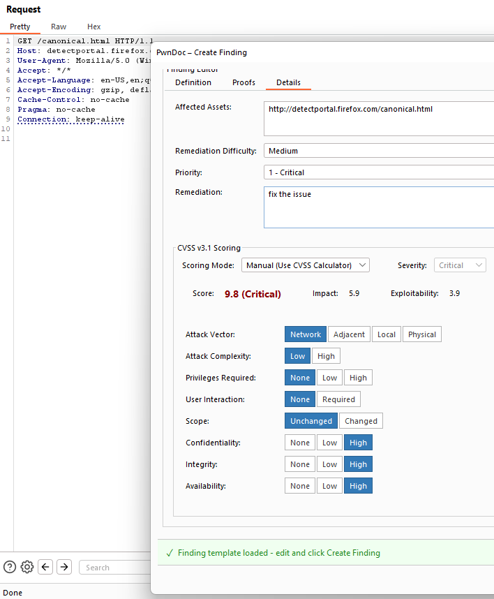

<p align="center">
  
</p>

<p align="center">
  <a href="https://github.com/walidfaour/pwndoc-burp/releases"></a>
  <a href="https://github.com/walidfaour/pwndoc-burp/blob/main/LICENSE"></a>
  <a href="https://github.com/walidfaour/pwndoc-burp/stargazers"></a>
  <a href="https://portswigger.net/burp"></a>
  <a href="https://www.java.com/"></a>
</p>

<p align="center">
  <b>Create and manage PwnDoc findings directly from Burp Suite with full CVSS 3.1 support</b>
</p>

---

## 📋 Table of Contents

- [About](#-about)
- [Features](#-features)
- [Screenshots](#-screenshots)
- [Quick Start (Pre-built JAR)](#-quick-start-pre-built-jar)
- [Building from Source](#-building-from-source)
  - [Prerequisites](#prerequisites)
  - [Windows](#windows)
  - [Linux](#linux)
  - [macOS](#macos)
- [Configuration](#-configuration)
- [Usage Guide](#-usage-guide)
- [Compatibility](#-compatibility)
- [Troubleshooting](#-troubleshooting)
- [Contributing](#-contributing)
- [License](#-license)
- [Acknowledgments](#-acknowledgments)

---

## 🎯 About

### What is PwnDoc?

[PwnDoc](https://github.com/pwndoc/pwndoc) is a powerful, open-source penetration testing report generator. It provides a collaborative platform for security teams to document vulnerabilities, manage audits, and generate professional reports with customizable templates.

### What is PwnDoc Burp?

**PwnDoc Burp** is a Burp Suite extension that bridges the gap between your web application security testing and documentation workflow. Instead of manually copying findings from Burp to PwnDoc, this extension allows you to create and update findings directly from Burp Suite's context menu.

### Why Use This Extension?

During penetration testing, you're constantly switching between Burp Suite and your documentation tool. This context switching:
- Wastes valuable testing time
- Increases the risk of missing details
- Makes it harder to capture request/response evidence
- Disrupts your testing flow

**PwnDoc Burp** solves these problems by letting you:
- Create findings without leaving Burp Suite
- Automatically capture HTTP request/response as evidence
- Use your existing PwnDoc vulnerability templates
- Calculate CVSS 3.1 scores with an interactive calculator
- Upload proof-of-concept screenshots directly

> 🚀 **Coming Soon**: This extension will be submitted to the BApp Store. Stay tuned for easier installation!

---

## ✨ Features

| Feature | Description |
|---------|-------------|
| 🔐 **Secure Authentication** | Connect to your PwnDoc instance with username/password authentication |
| 📝 **Create Findings** | Create new findings directly from HTTP requests in Burp |
| ✏️ **Update Findings** | Modify existing findings without leaving Burp Suite |
| 📚 **Vulnerability Library** | Browse and use your PwnDoc vulnerability templates |
| 🧮 **CVSS 3.1 Calculator** | Interactive calculator with real-time score computation |
| 📸 **Screenshot Upload** | Attach proof-of-concept images to findings |
| 🎨 **Custom Fields** | Full support for PwnDoc custom fields (filtered by audit type) |
| 🔄 **Auto-populate** | Request/response automatically captured as evidence |
| 📋 **Audit Management** | View and manage audits from within Burp Suite |
| 🌐 **Multi-language** | Works with PwnDoc's multi-language vulnerability templates |

---

## 📸 Screenshots

<details>
<summary>Click to view screenshots</summary>

### Context Menu Integration
Right-click any request to create or update findings:


### Finding Editor
Full-featured editor with all PwnDoc fields:


### CVSS Calculator
Interactive CVSS 3.1 calculator:



### Vulnerability Library
Browse and select from your templates:


</details>

---

## 🚀 Quick Start (Pre-built JAR)

The easiest way to get started is using the pre-built JAR file.

### Step 1: Download the Extension

Download the latest `pwndoc-burp-1.0.2.jar` from the [Releases](https://github.com/walidfaour/pwndoc-burp/releases) page.


### Step 2: Install in Burp Suite

1. Open **Burp Suite Professional** or **Community Edition**
2. Navigate to **Extensions** → **Installed**
3. Click **Add**
4. Set **Extension type** to `Java`
5. Click **Select file** and choose the downloaded `pwndoc-burp-1.0.2.jar`
6. Click **Next**

### Step 3: Configure the Extension

1. Go to the **PwnDoc** tab in Burp Suite
2. Enter your PwnDoc instance URL (e.g., `https://pwndoc.yourcompany.com`)
3. Enter your **username** and **password**
4. Click **Test Connection**
5. If successful, click **Save Configuration**

### Step 4: Start Using

1. Browse to a target in Burp's browser
2. Find an interesting request in **Proxy** → **HTTP history**
3. Right-click the request
4. Select **Extensions** → **PwnDoc** → **Create Finding** or **Update Finding**

---

## 🔨 Building from Source

### Prerequisites

Before building, ensure you have the following installed:

| Requirement | Version | Download |
|-------------|---------|----------|
| **Java JDK** | 21 or higher | [Eclipse Temurin](https://adoptium.net/) or [Oracle JDK](https://www.oracle.com/java/technologies/downloads/) |
| **Git** | Any recent version | [git-scm.com](https://git-scm.com/) |

> **Note**: Gradle wrapper is included in the repository, so you don't need to install Gradle separately.

### Verify Java Installation

```bash
java -version
# Should show: openjdk version "21.x.x" or similar
```

---

### Windows

#### Option A: Using Command Prompt

```cmd
:: 1. Clone the repository
git clone https://github.com/walidfaour/pwndoc-burp.git
cd pwndoc-burp

:: 2. Build the project
gradlew.bat build

:: 3. Find the JAR file
dir build\libs\

:: Look for: pwndoc-burp-1.0.2.jar

```

#### Option B: Using PowerShell

```powershell
# 1. Clone the repository
git clone https://github.com/walidfaour/pwndoc-burp.git
cd pwndoc-burp

# 2. Build the project
.\gradlew.bat build

# 3. Find the JAR file
Get-ChildItem build\libs\

# Look for: pwndoc-burp-1.0.2.jar

```

#### Option C: Using Git Bash

```bash
# 1. Clone the repository
git clone https://github.com/walidfaour/pwndoc-burp.git
cd pwndoc-burp

# 2. Build the project
./gradlew build

# 3. Find the JAR file
ls build/libs/

# Look for: pwndoc-burp-1.0.2.jar
```
**Output Location**: `build\libs\pwndoc-burp-1.0.2.jar`

```


---

### Linux

#### Ubuntu/Debian

```bash
# 1. Install Java 21 (if not installed)
sudo apt update
sudo apt install openjdk-21-jdk

# 2. Verify Java installation
java -version

# 3. Clone the repository
git clone https://github.com/walidfaour/pwndoc-burp.git
cd pwndoc-burp

# 4. Make gradlew executable
chmod +x gradlew

# 5. Build the project
./gradlew build

# 6. Find the JAR file
ls -la build/libs/
odex/clarify-topic-details-ftnauh
# Look for: pwndoc-burp-1.0.2.jar


```

#### Fedora/RHEL/CentOS

```bash
# 1. Install Java 21 (if not installed)
sudo dnf install java-21-openjdk-devel

# 2. Verify Java installation
java -version

# 3. Clone the repository
git clone https://github.com/walidfaour/pwndoc-burp.git
cd pwndoc-burp

# 4. Make gradlew executable
chmod +x gradlew

# 5. Build the project
./gradlew build

# 6. Find the JAR file
ls -la build/libs/
# Look for: pwndoc-burp-1.0.2.jar


```

#### Arch Linux

```bash
# 1. Install Java 21 (if not installed)
sudo pacman -S jdk21-openjdk

# 2. Set as default (if multiple Java versions)
sudo archlinux-java set java-21-openjdk

# 3. Clone and build
git clone https://github.com/walidfaour/pwndoc-burp.git
cd pwndoc-burp
chmod +x gradlew
./gradlew build
```

**Output Location**: `build/libs/pwndoc-burp-1.0.2.jar`

---

### macOS

#### Using Homebrew (Recommended)

```bash
# 1. Install Java 21 (if not installed)
brew install openjdk@21

# 2. Add to PATH (add to ~/.zshrc or ~/.bash_profile for persistence)
export PATH="/opt/homebrew/opt/openjdk@21/bin:$PATH"

# 3. Verify Java installation
java -version

# 4. Clone the repository
git clone https://github.com/walidfaour/pwndoc-burp.git
cd pwndoc-burp

# 5. Make gradlew executable
chmod +x gradlew

# 6. Build the project
./gradlew build

# 7. Find the JAR file
ls -la build/libs/
# Look for: pwndoc-burp-1.0.2.jar
```

#### Using SDKMAN (Alternative)

```bash
# 1. Install SDKMAN (if not installed)
curl -s "https://get.sdkman.io" | bash
source "$HOME/.sdkman/bin/sdkman-init.sh"

# 2. Install Java 21
sdk install java 21-tem

# 3. Clone and build
git clone https://github.com/walidfaour/pwndoc-burp.git
cd pwndoc-burp
chmod +x gradlew
./gradlew build
```

**Output Location**: `build/libs/pwndoc-burp-1.0.2.jar`

---

### Build Commands Reference

| Command | Description |
|---------|-------------|
| `./gradlew build` | Build the project and create JAR |
| `./gradlew clean` | Clean build artifacts |
| `./gradlew clean build` | Clean and rebuild |
| `./gradlew tasks` | List all available tasks |
| `./gradlew shadowJar` | Create fat JAR with dependencies |

---

## ⚙️ Configuration

### Initial Setup

1. **Open the PwnDoc Tab**: After installing the extension, a new "PwnDoc" tab appears in Burp Suite.

2. **Configure Connection**:
   - **PwnDoc URL**: Enter your PwnDoc instance URL
     - Example: `https://pwndoc.company.com`
     - Include the protocol (`https://`)
     - Do NOT include trailing slash
   
   - **Username**: Your PwnDoc username
   - **Password**: Your PwnDoc password

3. **Test Connection**: Click the "Test Connection" button to verify your credentials.

4. **Save Configuration**: Click "Save" to persist your settings across Burp Suite restarts.

### Configuration Storage

Settings are stored securely using Burp Suite's persistence API and are saved per-project.

### Network Requirements

Ensure Burp Suite can reach your PwnDoc instance:
- Check firewall rules
- Verify VPN connection if required
- Ensure SSL certificates are valid (or add exceptions)

---

## 📖 Usage Guide

### Creating a New Finding

1. **Capture a Request**: Use Burp Suite to intercept or browse to the vulnerable endpoint.

2. **Open Context Menu**: Right-click on the request in:
   - Proxy → HTTP history
   - Repeater
   - Target → Site map
   - Any request panel

3. **Select Create Finding**: Choose `Extensions` → `PwnDoc` → `Create Finding`

4. **Select Audit**: Choose the target audit from the dropdown list.

5. **Choose Template (Optional)**: 
   - Click on the "Vulnerability Library" panel
   - Search or browse templates
   - Click a template to auto-populate fields

6. **Fill in Details**:
   - **Title**: Vulnerability name
   - **Type**: Category/type of vulnerability
   - **Description**: Detailed description
   - **Observation**: What you observed (auto-populated with request/response)
   - **Remediation**: How to fix the issue
   - **CVSS Score**: Use the interactive calculator
   - **References**: Add relevant links

7. **Add Proofs** (Optional):
   - Go to the "Proofs" tab
   - Click "Upload Files" to add screenshots
   - Files are uploaded when you save

8. **Save**: Click "Create Finding" to save to PwnDoc.

### Updating an Existing Finding

1. **Right-click a Request**: Same as creating a finding.

2. **Select Update Finding**: Choose `Extensions` → `PwnDoc` → `Update Finding`

3. **Select Audit**: Choose the audit containing the finding.

4. **Select Finding**: Choose the finding to update from the list.

5. **Modify Fields**: Update any fields as needed.

6. **Save**: Click "Update Finding" to save changes.

### Using the CVSS Calculator

The extension includes a full CVSS 3.1 calculator:

1. **Attack Vector (AV)**: Network, Adjacent, Local, Physical
2. **Attack Complexity (AC)**: Low, High
3. **Privileges Required (PR)**: None, Low, High
4. **User Interaction (UI)**: None, Required
5. **Scope (S)**: Unchanged, Changed
6. **Confidentiality (C)**: None, Low, High
7. **Integrity (I)**: None, Low, High
8. **Availability (A)**: None, Low, High

The score and severity are calculated in real-time as you select options.

### Viewing Audits

1. Navigate to the **PwnDoc** tab in Burp Suite.
2. Click on the **Audits** panel.
3. View all available audits with their status.
4. Double-click to view audit details.

---

## 🔧 Compatibility

### Burp Suite Versions

| Version | Status | Notes |
|---------|--------|-------|
| Burp Suite 2024.x+ | ✅ Fully Supported | Recommended |
| Burp Suite 2023.x | ✅ Supported | Tested |
| Burp Suite 2022.x | ⚠️ May Work | Not tested |
| Burp Suite < 2022 | ❌ Not Supported | Uses legacy API |

### Java Versions

| Version | Status | Notes |
|---------|--------|-------|
| Java 21+ | ✅ Recommended | Built with Java 21 |
| Java 17 | ⚠️ May Work | Not officially supported |
| Java 11 | ❌ Not Supported | Requires Java 17+ |
| Java 8 | ❌ Not Supported | Too old |

### PwnDoc Versions

| Version | Status |
|---------|--------|
| PwnDoc 0.6.x+ | ✅ Supported |
| PwnDoc 0.5.x | ✅ Supported |
| PwnDoc-NG | ✅ Supported |

### Operating Systems

| OS | Status |
|----|--------|
| Windows 10/11 | ✅ Supported |
| macOS 12+ (Intel & Apple Silicon) | ✅ Supported |
| Linux (Ubuntu, Debian, Fedora, etc.) | ✅ Supported |

---

## 🔍 Troubleshooting

### Common Issues

<details>
<summary><b>Extension fails to load</b></summary>

**Symptoms**: Error message when adding extension, or extension doesn't appear.

**Solutions**:
1. Verify Java 21+ is installed: `java -version`
2. Check Burp Suite's Java settings: `Settings` → `Extensions` → `Java Environment`
3. Try using the JAR from a path without special characters
4. Check Burp's Extensions → Errors tab for details
</details>

<details>
<summary><b>Connection to PwnDoc fails</b></summary>

**Symptoms**: "Connection failed" or timeout errors.

**Solutions**:
1. Verify the URL is correct (include `https://`, no trailing slash)
2. Check if PwnDoc is accessible from your browser
3. Verify firewall/VPN settings
4. Check if Burp's upstream proxy settings are blocking requests
5. Try accessing PwnDoc API directly: `https://your-pwndoc/api/users/me`
</details>

<details>
<summary><b>Authentication fails</b></summary>

**Symptoms**: "Invalid credentials" error.

**Solutions**:
1. Double-check username and password
2. Ensure your account is not locked
3. Try logging in via PwnDoc web interface first
4. Check if 2FA is enabled (not supported yet)
</details>

<details>
<summary><b>CVSS score shows incorrect value</b></summary>

**Symptoms**: Score doesn't match expected value.

**Solutions**:
1. Ensure all CVSS metrics are selected
2. Check if Scope is set correctly (affects PR scoring)
3. Compare with NIST calculator: https://nvd.nist.gov/vuln-metrics/cvss/v3-calculator
</details>

<details>
<summary><b>Images not appearing in PwnDoc</b></summary>

**Symptoms**: Uploaded screenshots don't show in finding.

**Solutions**:
1. Check file format (PNG, JPG supported)
2. Verify file size is reasonable (< 10MB)
3. Check PwnDoc storage configuration
4. Look for errors in Burp's Output tab
</details>

### Getting Help

If you encounter issues not covered above:

1. **Check the Output Tab**: Go to `Extensions` → `Installed` → Select `PwnDoc` → `Output` tab for detailed logs.

2. **Enable Debug Logging**: The extension logs detailed information to help diagnose issues.

3. **Open an Issue**: Create an issue on [GitHub](https://github.com/walidfaour/pwndoc-burp/issues) with:
   - Burp Suite version
   - Java version
   - PwnDoc version
   - Error messages from Output tab
   - Steps to reproduce

---

## 🤝 Contributing

Contributions are welcome! Here's how you can help:

### Reporting Bugs

1. Check existing [issues](https://github.com/walidfaour/pwndoc-burp/issues) first
2. Create a new issue with:
   - Clear title and description
   - Steps to reproduce
   - Expected vs actual behavior
   - Environment details

### Suggesting Features

1. Open a [feature request](https://github.com/walidfaour/pwndoc-burp/issues/new?labels=enhancement)
2. Describe the feature and use case
3. Explain how it would benefit users

### Code Contributions

1. Fork the repository
2. Create a feature branch: `git checkout -b feature/amazing-feature`
3. Make your changes
4. Test thoroughly
5. Commit: `git commit -m 'Add amazing feature'`
6. Push: `git push origin feature/amazing-feature`
7. Open a Pull Request

### Development Setup

```bash
# Clone your fork
git clone https://github.com/YOUR_USERNAME/pwndoc-burp.git
cd pwndoc-burp

# Build
./gradlew build

# The JAR will be in build/libs/
```

---

## 📄 License

This project is licensed under the **MIT License** - see the [LICENSE](LICENSE) file for details.

```
MIT License

Copyright (c) 2025 Walid Faour

Permission is hereby granted, free of charge, to any person obtaining a copy
of this software and associated documentation files (the "Software"), to deal
in the Software without restriction, including without limitation the rights
to use, copy, modify, merge, publish, distribute, sublicense, and/or sell
copies of the Software...
```

---

## 🙏 Acknowledgments

- **[PwnDoc](https://github.com/pwndoc/pwndoc)** - The amazing pentest reporting tool this extension integrates with
- **[PortSwigger](https://portswigger.net/)** - For Burp Suite and the Montoya API
- **[Gradle](https://gradle.org/)** - Build automation
- **[Gson](https://github.com/google/gson)** - JSON processing

---

## 📞 Contact

**Walid Faour** - [@walidfaour](https://github.com/walidfaour)

Project Link: [https://github.com/walidfaour/pwndoc-burp](https://github.com/walidfaour/pwndoc-burp)

---

<p align="center">
  <b>If you find this project useful, please consider giving it a ⭐</b>
</p>

<p align="center">
  Made with ❤️ for the security community
</p>
